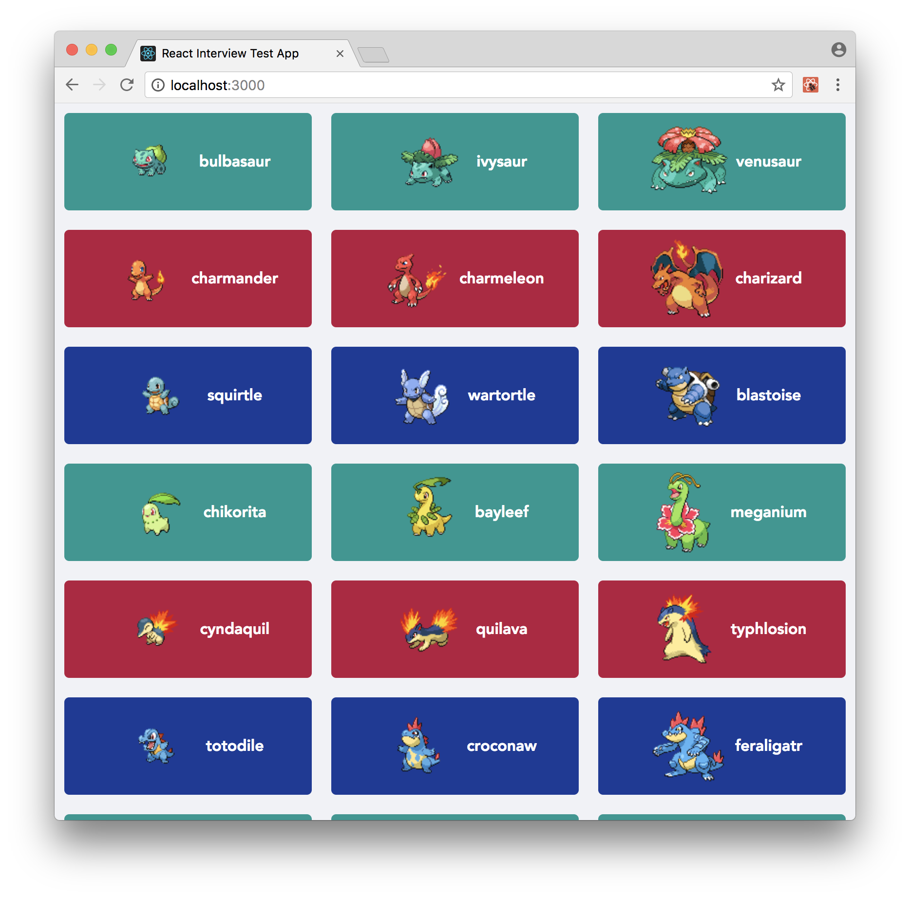

# React Interview Test

This is a small react application that takes pokemon data from [pokeapi](https://pokeapi.co) and renders it to the screen. It looks like this:

Please modify this application in the following ways:

1. The name of each pokemon should be capitalized (for example the screen shot shows `bulbasaur` - make it show `Bulbasaur`)
2. Clicking on a pokemon should take me to a screen where I see all of the available sprites for the pokemon I just clicked
